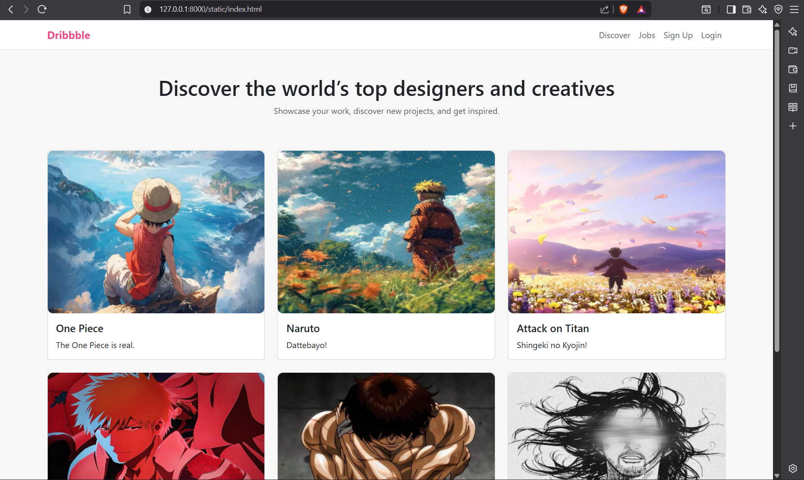
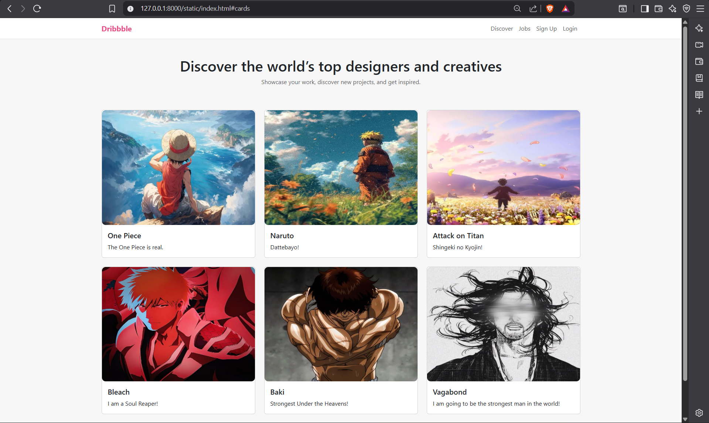
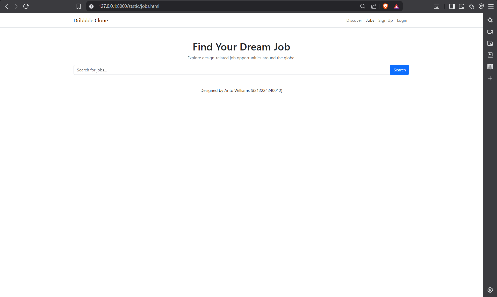
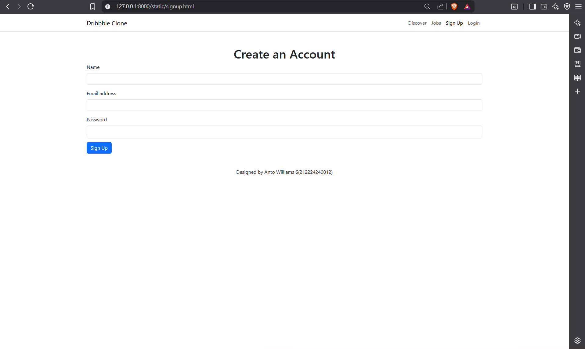
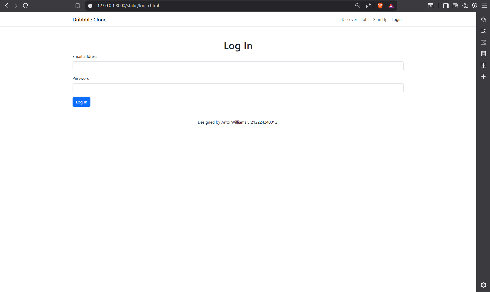

# Project Responsive Web Design using Bootstrap
## Date:
28-05-2026

## AIM:
To create a simplified clone of Dribbble (https://dribbble.com/) landing page.


## DESIGN STEPS:

### Step 1:
Clone the repository from GitHub.

### Step 2:
Create Django Admin project.

### Step 3:
Create a New App under the Django Admin project.

### Step 4:
Insert the necessary CSS and JavaScript files as external in order to use Bootstrap.

### Step 5:
Create a HTML file and include the needed Bootstrap components.

### Step 6:
Publish the website in the LocalHost.

## PROGRAM :

### Discover Page
```
<!DOCTYPE html>
<html lang="en">
<head>
    <meta charset="UTF-8">
    <meta name="viewport" content="width=device-width, initial-scale=1.0">
    <title>Dribbble Clone</title>
    <link href="https://cdn.jsdelivr.net/npm/bootstrap@5.3.0/dist/css/bootstrap.min.css" rel="stylesheet">
</head>
<body>

<nav class="navbar navbar-expand-lg navbar-light border-bottom">
    <div class="container">
        <a class="navbar-brand" href="index.html">Dribbble</a>
        <button class="navbar-toggler" type="button" data-bs-toggle="collapse" data-bs-target="#navbarNav" aria-controls="navbarNav" aria-expanded="false" aria-label="Toggle navigation">
            <span class="navbar-toggler-icon"></span>
        </button>
        <div class="collapse navbar-collapse" id="navbarNav">
            <ul class="navbar-nav ms-auto">
                <li class="nav-item">
                    <a class="nav-link" href="#cards">Discover</a>
                </li>
                <li class="nav-item">
                    <a class="nav-link" href="jobs.html">Jobs</a>
                </li>
                <li class="nav-item">
                    <a class="nav-link" href="signup.html">Sign Up</a>
                </li>
                <li class="nav-item">
                    <a class="nav-link" href="login.html">Login</a>
                </li>
            </ul>
        </div>
    </div>
</nav>

<div class="container text-center py-5">
    <h1>Discover the world’s top designers and creatives</h1>
    <p class="text-muted">Showcase your work, discover new projects, and get inspired.</p>
</div>

<div id="cards" class="container">
    <div class="row g-4">
        <div class="col-md-4 col-sm-6">
            <div class="card">
                
                <div class="card-body">
                    <h5 class="card-title">One Piece</h5>
                    <p class="card-text">The One Piece is real.</p>
                </div>
            </div>
        </div>
        <div class="col-md-4 col-sm-6">
            <div class="card">
                
                <div class="card-body">
                    <h5 class="card-title">Naruto</h5>
                    <p class="card-text">Dattebayo!</p>
                </div>
            </div>
        </div>
        <div class="col-md-4 col-sm-6">
            <div class="card">
                
                <div class="card-body">
                    <h5 class="card-title">Attack on Titan</h5>
                    <p class="card-text">Shingeki no Kyojin!</p>
                </div>
            </div>
        </div>
        <div class="col-md-4 col-sm-6">
            <div class="card">
                
                <div class="card-body">
                    <h5 class="card-title">Bleach</h5>
                    <p class="card-text">I am a Soul Reaper!</p>
                </div>
            </div>
        </div>
        <div class="col-md-4 col-sm-6">
            <div class="card">
                
                <div class="card-body">
                    <h5 class="card-title">Baki</h5>
                    <p class="card-text">Strongest Under the Heavens!</p>
                </div>
            </div>
        </div>
        <div class="col-md-4 col-sm-6">
            <div class="card">
                
                <div class="card-body">
                    <h5 class="card-title">Vagabond</h5>
                    <p class="card-text">I am going to be the strongest man in the world!</p>
                </div>
            </div>
        </div>
    </div>
</div>

<footer class="footer mt-5">
    <div class="container text-center">
        <p>Designed by Anto Williams S(212224240012)</p>
    </div>
</footer>

<script src="https://cdn.jsdelivr.net/npm/bootstrap@5.3.0/dist/js/bootstrap.bundle.min.js"></script>
</body>
</html>
```

### Job Page
```
<!DOCTYPE html>
<html lang="en">
<head>
    <meta charset="UTF-8">
    <meta name="viewport" content="width=device-width, initial-scale=1.0">
    <title>Jobs - Dribbble Clone</title>
    <link href="https://cdn.jsdelivr.net/npm/bootstrap@5.3.0/dist/css/bootstrap.min.css" rel="stylesheet">
</head>
<body>
<nav class="navbar navbar-expand-lg navbar-light border-bottom">
    <div class="container">
        <a class="navbar-brand" href="index.html">Dribbble Clone</a>
        <button class="navbar-toggler" type="button" data-bs-toggle="collapse" data-bs-target="#navbarNav" aria-controls="navbarNav" aria-expanded="false" aria-label="Toggle navigation">
            <span class="navbar-toggler-icon"></span>
        </button>
        <div class="collapse navbar-collapse" id="navbarNav">
            <ul class="navbar-nav ms-auto">
                <li class="nav-item"><a class="nav-link" href="index.html">Discover</a></li>
                <li class="nav-item"><a class="nav-link active" href="jobs.html">Jobs</a></li>
                <li class="nav-item"><a class="nav-link" href="signup.html">Sign Up</a></li>
                <li class="nav-item"><a class="nav-link" href="login.html">Login</a></li>
            </ul>
        </div>
    </div>
</nav>


<div class="container my-5">
    <h1 class="text-center">Find Your Dream Job</h1>
    <p class="text-center text-muted">Explore design-related job opportunities around the globe.</p>
    <div class="input-group mb-3">
        <input type="text" class="form-control" placeholder="Search for jobs..." aria-label="Search" aria-describedby="search-button">
        <button class="btn btn-primary" type="button" id="search-button">Search</button>
    </div>
</div>
<footer class="footer mt-5">
    <div class="container text-center">
        <p>Designed by Anto Williams S(212224240012)</p>
    </div>
</footer>

<script src="https://cdn.jsdelivr.net/npm/bootstrap@5.3.0/dist/js/bootstrap.bundle.min.js"></script>
</body>
</html>
```

### SignUp Page
```
<!DOCTYPE html>
<html lang="en">
<head>
    <meta charset="UTF-8">
    <meta name="viewport" content="width=device-width, initial-scale=1.0">
    <title>Sign Up - Dribbble Clone</title>
    <link href="https://cdn.jsdelivr.net/npm/bootstrap@5.3.0/dist/css/bootstrap.min.css" rel="stylesheet">
</head>
<body>
<nav class="navbar navbar-expand-lg navbar-light border-bottom">
    <div class="container">
        <a class="navbar-brand" href="index.html">Dribbble Clone</a>
        <button class="navbar-toggler" type="button" data-bs-toggle="collapse" data-bs-target="#navbarNav" aria-controls="navbarNav" aria-expanded="false" aria-label="Toggle navigation">
            <span class="navbar-toggler-icon"></span>
        </button>
        <div class="collapse navbar-collapse" id="navbarNav">
            <ul class="navbar-nav ms-auto">
                <li class="nav-item"><a class="nav-link" href="index.html">Discover</a></li>
                <li class="nav-item"><a class="nav-link" href="jobs.html">Jobs</a></li>
                <li class="nav-item"><a class="nav-link active" href="signup.html">Sign Up</a></li>
                <li class="nav-item"><a class="nav-link" href="login.html">Login</a></li>
            </ul>
        </div>
    </div>
</nav>

<div class="container my-5">
    <h1 class="text-center">Create an Account</h1>
    <form>
        <div class="mb-3">
            <label for="name" class="form-label">Name</label>
            <input type="text" class="form-control" id="name" required>
        </div>
        <div class="mb-3">
            <label for="email" class="form-label">Email address</label>
            <input type="email" class="form-control" id="email" required>
        </div>
        <div class="mb-3">
            <label for="password" class="form-label">Password</label>
            <input type="password" class="form-control" id="password" required>
        </div>
        <button type="submit" class="btn btn-primary">Sign Up</button>
    </form>
</div>

<footer class="footer mt-5">
    <div class="container text-center">
        <p>Designed by Anto Williams S(212224240012)</p>
    </div>
</footer>

<script src="https://cdn.jsdelivr.net/npm/bootstrap@5.3.0/dist/js/bootstrap.bundle.min.js"></script>
</body>
</html>
```

### Login Page
```
<!DOCTYPE html>
<html lang="en">
<head>
    <meta charset="UTF-8">
    <meta name="viewport" content="width=device-width, initial-scale=1.0">
    <title>Login - Dribbble Clone</title>
    <link href="https://cdn.jsdelivr.net/npm/bootstrap@5.3.0/dist/css/bootstrap.min.css" rel="stylesheet">
</head>
<body>
<nav class="navbar navbar-expand-lg navbar-light border-bottom">
    <div class="container">
        <a class="navbar-brand" href="index.html">Dribbble Clone</a>
        <button class="navbar-toggler" type="button" data-bs-toggle="collapse" data-bs-target="#navbarNav" aria-controls="navbarNav" aria-expanded="false" aria-label="Toggle navigation">
            <span class="navbar-toggler-icon"></span>
        </button>
        <div class="collapse navbar-collapse" id="navbarNav">
            <ul class="navbar-nav ms-auto">
                <li class="nav-item"><a class="nav-link" href="index.html">Discover</a></li>
                <li class="nav-item"><a class="nav-link" href="jobs.html">Jobs</a></li>
                <li class="nav-item"><a class="nav-link" href="signup.html">Sign Up</a></li>
                <li class="nav-item"><a class="nav-link active" href="login.html">Login</a></li>
            </ul>
        </div>
    </div>
</nav>

<div class="container my-5">
    <h1 class="text-center">Log In</h1>
    <form>
        <div class="mb-3">
            <label for="email" class="form-label">Email address</label>
            <input type="email" class="form-control" id="email" required>
        </div>
        <div class="mb-3">
            <label for="password" class="form-label">Password</label>
            <input type="password" class="form-control" id="password" required>
        </div>
        <button type="submit" class="btn btn-primary">Log In</button>
    </form>
</div>

<footer class="footer mt-5">
    <div class="container text-center">
        <p>Designed by Anto Williams S(212224240012)p>
    </div>
</footer>

<script src="https://cdn.jsdelivr.net/npm/bootstrap@5.3.0/dist/js/bootstrap.bundle.min.js"></script>
</body>
</html>
```
## OUTPUT:











## RESULT:
The Project for responsive web design using Bootstrap is completed successfully.
